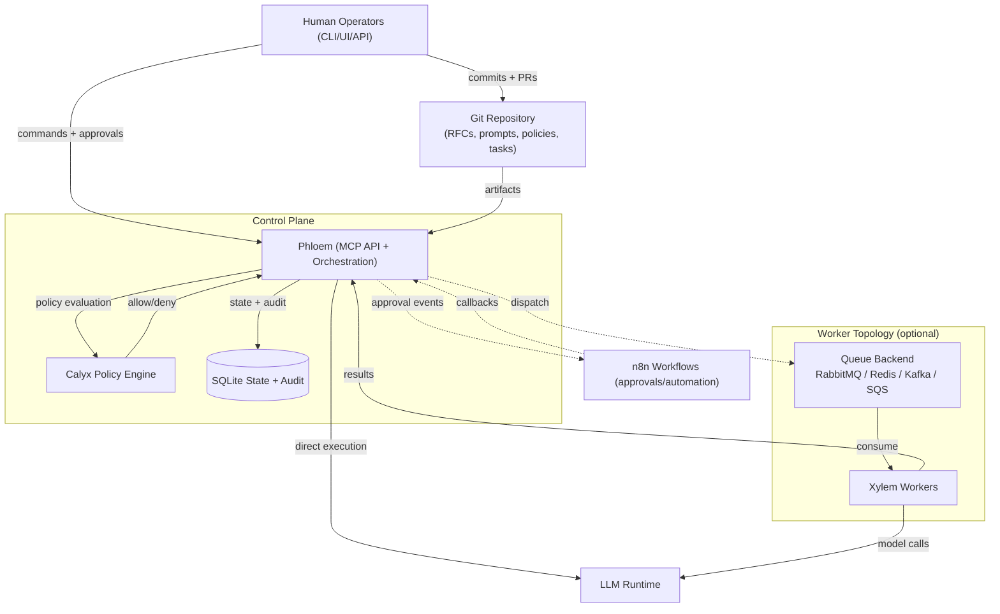

# Anthesis


> *Anthesis* — the phase in which a flower is fully open and capable of function.

---

## Overview

Anthesis is a **governed, Git-native agent orchestration platform for software delivery (SDLC)**.

It enables teams to integrate AI/LLM agents into development workflows while maintaining:

* explicit approval control
* full auditability
* deterministic, reproducible execution

Unlike typical agent systems, Anthesis does **not permit implicit autonomy**.

All execution is modeled as a **controlled state transition**:

→ context is assembled
→ risk is evaluated
→ approval is required
→ execution is recorded

This allows AI-assisted workflows to operate safely in **production and regulated environments**.

---

## Why Anthesis

Most AI-assisted development tools prioritize autonomy over control, introducing risks:

* non-deterministic execution
* lack of auditability
* implicit or opaque decision-making
* difficulty operating under compliance constraints

Anthesis enforces a different model:

* execution is **explicitly governed**
* agents operate within **policy-defined boundaries**
* all actions are **traceable and reproducible**
* system behavior is anchored to **version-controlled artifacts (Git)**

---

## Example Workflow

A typical execution flow:

1. A developer updates a requirement, task, or code artifact
2. Anthesis assembles context (code, RFCs, prior decisions)
3. Calyx evaluates risk and determines approval requirements
4. Approval is granted (human or automated)
5. Xylem executes the task via LLM or worker runtime
6. Results are validated, committed, and recorded

**Result:**

* no uncontrolled AI execution
* full audit trail
* reproducible workflows

---

## Core Principles

1. **Governed Autonomy**
   Agents act only within policy, context, and traceable boundaries.

2. **Human Authority First**
   Humans remain final arbiters via approvals and overrides.

3. **Deterministic Execution**
   Identical inputs and context produce consistent outcomes.

4. **Auditability by Design**
   All actions, approvals, and state transitions are recorded.

5. **Living Architecture**
   RFCs, prompts, and policies evolve as first-class, versioned artifacts.

---

## Execution Lifecycle

Every action follows a controlled lifecycle:

1. **Pre-Bloom** — Change or event detected
2. **Context Assembly** — Relevant artifacts retrieved (embeddings + repo state)
3. **Calyx Gate** — Policy evaluation and risk classification
4. **Approval** — Human or automated authorization
5. **Anthesis** — Execution with full context
6. **Dormancy** — Completion, rollback, or safe halt

Autonomy is **conditional**, not default.

---

## System Overview

Anthesis is composed of three primary layers:

* **Control Plane** — orchestration, state management, and policy enforcement
* **Execution Layer** — worker runtime and LLM interaction
* **Governance Layer** — approvals, risk evaluation, and audit

### Primary Components

* **Git Repository**
  Canonical source for RFCs, prompts, policies, and tasks

* **Phloem (MCP API + Orchestration)**
  Control plane responsible for execution flow, state transitions, and coordination

* **Calyx (Policy Engine)**
  Evaluates risk, enforces policy, and determines approval requirements

* **Xylem (Workers)**
  Executes tasks, interacts with LLMs, and returns results

* **Inflorescence**
  Graph-based coordination layer for multi-agent workflows

---

## Architecture

The diagram below shows how Anthesis coordinates human input, policy evaluation, and agent execution:



---

## Governance & RFC Model

Anthesis is **charter-first and RFC-driven**.

Core governance defines:

* orchestration and execution contracts
* policy and approval semantics
* agent execution modes and retry behavior
* CLI behavior and workflow guarantees
* audit and evidence requirements
* configuration and operating modes

Extended governance includes:

* decision frameworks (QART)
* drift detection and reconciliation
* prompt and context lifecycle management
* plugin and extension boundaries

---

## Security & Compliance

Anthesis is designed for environments requiring **strong control, traceability, and auditability**.

### Security Controls

* **Governed execution** — no action without policy and approval
* **Centralized enforcement** — Phloem + Calyx enforce all execution gates
* **Least privilege** — RBAC, scoped APIs, and isolation boundaries
* **Audit-first design** — all critical actions produce evidence
* **Fail-safe behavior** — safe halt, rollback, and replay

### Security Lifecycle

* Threat modeling for high-risk changes (auth, data, integrations)
* Pre-deploy validation (input validation, secrets, dependencies, logging)
* Tiered controls based on risk classification
* Defined incident response and recovery procedures

### Compliance Alignment

* Audit-ready artifacts (logs, approvals, state transitions)
* Alignment with SOC 2 (in progress), ISO 27001 (planned), NIST SSDF
* Supply chain controls (dependency scanning, CVE review)

---

## Quick Start

```bash
make deps
docker compose --profile worker up
anthesis --help
```

---

## Testing

```bash
make test
make test-units
make test-integration
```

---

## Status

Active development with RFC-driven governance and iterative delivery.

---

## License

Closed source. All rights reserved.

The maintainers reserve the right to publish an open-source license for all or part of this project in the future.
