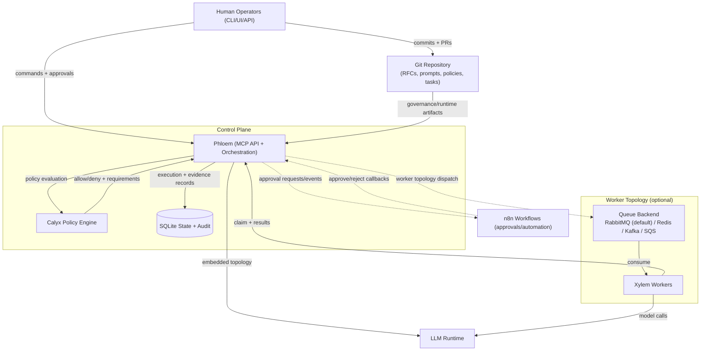

# Anthesis


> *Anthesis* — the phase in which a flower is fully open and capable of function.

Anthesis is a governed, Git-native, agentic SDLC platform that enables automation without surrendering human authority, auditability, or safety.

Autonomous actions occur **only when context is complete, risk is understood, and authority is explicit**.

Anthesis treats AI execution as a *governed state transition*, not a default behavior.

## Why Anthesis

Anthesis treats autonomous execution as a governed state transition, not a default behavior.

- Human authority remains final.
- Agent actions require explicit policy and approvals.
- Execution is traceable, reproducible, and reviewable.
- Drift is detected and reconciled against canonical intent.

Anthesis treats AI execution as a *governed state transition*, not a default behavior.

***

## Core Principles

1. **Governed Autonomy**  
   Agents may act independently, but never without policy, context, and traceability.

2. **Human Authority First**  
   Humans remain the final arbiters through approvals, overrides, and ownership.

3. **Deterministic Execution**  
   Every agent run is reproducible: same inputs, same context, same outcome.

4. **Auditability by Design**  
   All actions, approvals, and artifacts are recorded with immutable metadata.

5. **Living Architecture**  
   Specifications, prompts, and policies evolve continuously as first-class artifacts.

***

## The Anthesis Lifecycle

Every autonomous action follows a controlled lifecycle:

1. **Pre-Bloom** — Artifact change or event detected
2. **Context Assembly** — Relevant artifacts retrieved via embeddings
3. **Calyx Gate** — Policy and risk evaluation
4. **Approval** — Human or automated authorization
5. **Anthesis** — Agent executes with full context
6. **Dormancy** — Completion, rollback, or safe halt

This lifecycle ensures that autonomy is *earned*, not assumed.

***

## System Overview

Project Anthesis coordinates a team of specialized agents across the full *Software Development Lifecycle (SDLC)*:

- Requirements
- Analysis & Design
- Implementation
- Testing
- Maintenance

### Primary Pillars

1. **Git Repository** — Source of truth for all artifacts, branch control, PRs
2. **Phloem (MCP API + Orchestration)** — Central control plane for execution and policy-bound flow control.
3. **Xylem (Worker)** — Executes tasks, consumes queues, and interacts with LLMs
4. **Inflorescence** — Graph-based multi-agent coordination and workflow management
5. **Calyx** — Policy engine for risk evaluation and approval gating

### Control Surfaces

1. **Human Operators (CLI/UI/API)** — Submit commands, approvals, and governance decisions.
2. **Git** — Canonical source for RFCs, prompts, policies, and task artifacts.
3. **Workflows** — Externalized approval/automation callbacks (n8n).
4. **Notifications** — Slack, Email, Phone, etc.

### Data Surfaces

1. **DB State + Audit** — Durable execution state and evidence trail with embedding vectors and encryption.
2. **LLM Runtime** — Model execution target for embedded or worker-dispatched runs.

### Runtime Components

1. **Queue Backend** — RabbitMQ (default) or Redis/Kafka/SQS for worker topology.
2. **Xylem Workers** — Consume dispatch messages, claim executions, and return results.

## Architecture At A Glance



## Governance And Core RFCs

Anthesis governance is charter-first and RFC-driven.

Foundational RFCs:

- **RFC-0002 — MCP Orchestration API:** Defines MCP as the authoritative execution orchestrator and contract boundary.
- **RFC-0003 — Calyx Approval Policy Engine:** Defines policy evaluation, approval requirements, and audit-grade decision outputs.
- **RFC-0009 — Agent Execution Semantics:** Defines execution modes, queue/worker dispatch, retries, and claim/lock behavior.
- **RFC-0020 — Anthesis State Machine:** Defines canonical workflow-phase law and lifecycle gates.
- **RFC-0021 — Anthesis CLI UX & Command Semantics:** Defines stable CLI behavior and command semantics.
- **RFC-0023 — Audit, Compliance & Evidence Export:** Defines evidence guarantees, exportability, and audit packaging.
- **RFC-0027 — Configuration Model:** Defines configuration precedence, security constraints, and mode/topology contract.

Operational RFCs:

- **RFC-0038 — Unified Governance Control Doctrine:** Binds pre-decision (QART) and post-decision (drift reconciliation) governance into one control loop.
- **RFC-0034 — Sessions & Prompt Context Governance:** Defines session declarations, prompt context assembly, and context-governance boundaries.
- **RFC-0035 — Operating Modes (Offline / Local / Remote):** Defines mode constraints, allowed integrations, and posture transitions.
- **RFC-0026 — Plugin & Extension Model:** Defines extension contracts, capability boundaries, and lifecycle for plugins.

Related governance RFCs:

- **RFC-0036 — QART Engineering**
- **RFC-0037 — Drift Loop Engineering**

## Quick Start

```bash
# From repo root
make deps
docker compose --profile worker up
anthesis --help
```

## Testing

```bash
make test
make test-units
make test-integration
```

## Security And Compliance Posture

Anthesis applies defense-in-depth security controls with governance-first enforcement across policy, runtime, and operations.

### Security Controls

- **Human authority + governed autonomy:** Security-critical decisions remain human-controlled (auth/authz, policy changes, incident response, risk acceptance).
- **Policy enforcement at control plane:** Phloem + Calyx enforce approval and policy gates before execution.
- **Least privilege defaults:** RBAC/Casbin, scoped API access, and container/network boundary controls.
- **Auditability by default:** Security-relevant events (auth, authorization, config, approvals, state transitions) are evidence-bearing and reviewable.
- **Fail-safe posture:** Dormancy and recovery controls prioritize safe halt, evidence preservation, and deterministic replay where possible.

### Security Assurance Lifecycle

- **Threat modeling required** for trust-boundary and high-risk changes (auth, data handling, external integrations, agent execution paths).
- **Pre-deploy verification:** Bloom Class 2+ changes require checklist-based controls (input validation, secrets handling, dependency scanning, logging/monitoring, security tests).
- **Tiered rigor:** Higher Bloom tiers add manual security review, architecture/attack-surface review, and stronger approval requirements.
- **Incident readiness:** Documented severity levels and response timelines support operational security response.

### Compliance Posture

- **Audit/compliance evidence:** Execution logs, approval records, configuration changes, and state transitions are treated as compliance artifacts.
- **Framework alignment:** SOC 2 Type II is in progress, ISO 27001 is planned, and NIST SSDF is used as a reference framework.
- **Third-party/supply-chain controls:** Dependency scanning, CVE review, and license/compliance checks are part of the security baseline.

## Contributing

1. Start from governing sources: `CHARTER.md`, then `meristem/` RFCs.
2. Keep changes scoped and auditable.
3. Run relevant tests before proposing integration.
4. Use conventional commits (for example: `feat(cli): ...`, `fix(meristem): ...`).

## Status

Active development with RFC-driven governance and iterative delivery.

## License

Closed source. All rights reserved.

The maintainers reserve the right to publish an open-source license for all or part of this project in the future.
