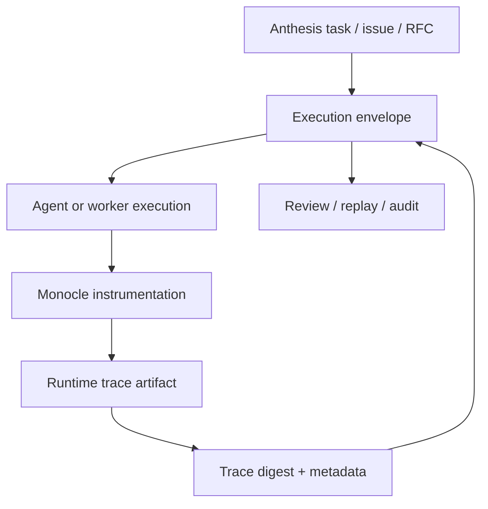

# Monocle Trace Evidence Integration Plan

## Purpose

This planning note evaluates Monocle as a possible runtime trace evidence provider for Anthesis.

The goal is not to make Monocle a core dependency. The goal is to define how Anthesis could consume Monocle-style GenAI traces as one evidence source inside Git-native governance workflows.

## Working Position

Monocle is observability-native.

Anthesis is governance-native and Git-native.

The useful integration point is evidence binding:

```text
Monocle observes agent/model/tool runtime behavior.
Anthesis binds that behavior to policy, approval, actor identity, repo state, and review artifacts.
```

## Why This Matters

Anthesis needs evidence that can answer:

- What was requested?
- Which actor performed the work?
- Which policy applied?
- Which repo state was used?
- Which approvals were required?
- What actually happened during execution?
- Which artifacts prove the result?
- Can the workflow be reviewed or replayed?

Git and CI are strong for intended change and review flow. Runtime traces are stronger for explaining agent/model/tool behavior during execution.

## Proposed Architecture



## Minimal Adapter Flow

1. Anthesis creates or resumes an execution envelope.
2. The worker runtime starts with envelope metadata in the environment or execution context.
3. Monocle instruments model, retrieval, and tool activity.
4. The trace is exported to a configured destination.
5. Anthesis records the trace ID, artifact URI, digest, redaction profile, and retention class.
6. Validation checks bind the trace to the envelope, actor, policy version, and commit SHA.

## Candidate Metadata Injection

Anthesis should provide runtime context that a trace provider can include as attributes:

```yaml
anthesis_context:
  envelope_id: env-123
  actor_id: agent:xylem-default
  repository: hackelia-micrantha/anthesis-community
  commit: abc123
  branch: feature/example
  policy_version: policy-2026-06-14
  approval_state: approved
  risk_tier: review-required
```

This metadata makes traces useful as governed evidence rather than isolated observability output.

## What Anthesis Should Consume

Anthesis should consume:

- trace ID
- span summary
- model/provider metadata
- tool call metadata
- retrieval metadata
- error/failure information
- artifact URI
- digest
- redaction profile
- retention class
- envelope binding metadata

Anthesis should avoid storing raw full prompts, raw model responses, or full retrieved documents by default.

## What Anthesis Should Not Own

Anthesis should not own:

- full observability UI
- vendor-specific tracing internals
- full OpenTelemetry collector operations
- all GenAI tracing standards
- long-term trace analytics storage
- framework-specific monkeypatching

Those are provider or deployment concerns.

## Security and Governance Concerns

### Sensitive Trace Content

Runtime traces can expose prompts, responses, retrieved material, tool arguments, paths, URLs, and other internal details.

Mitigation:

- require explicit redaction profiles
- classify retention by risk tier
- store summaries by default
- preserve full trace artifacts only when policy allows

### Evidence Integrity

A trace is not sufficient evidence unless it is bound to the envelope and artifact digest.

Mitigation:

- record digest
- bind to commit SHA
- bind to policy version
- bind to actor identity
- record approval state

### Detached Observability

Observability systems can retain useful traces that are disconnected from review history.

Mitigation:

- Anthesis stores trace evidence metadata inside the envelope
- trace artifacts are referenced from reviewable evidence manifests
- unavailable external traces are treated as degraded evidence

## Open Questions for Monocle Maintainers

- What export format should be treated as stable enough for evidence ingestion?
- Can user-defined attributes reliably attach Anthesis envelope metadata to traces?
- What redaction controls exist before traces leave the process?
- How are MCP/tool calls represented in spans?
- How are agent handoffs represented?
- Can trace IDs be supplied externally, or only generated by the tracer?
- Is there a recommended way to test expected tool/model call behavior from traces?
- Can Monocle emit compact trace summaries suitable for Git storage?

## Contribution Opportunities

Possible contribution areas:

- Anthesis-style evidence metadata conventions for GenAI traces
- redaction profile examples
- audit-oriented trace examples
- MCP/tool-call trace test cases
- envelope-to-trace correlation examples
- threat model notes for trace evidence
- documentation comparing observability evidence and governance evidence

## MVP Boundary

A practical MVP should be docs and fixtures only:

- define the evidence contract
- create a sample trace evidence manifest
- create a sample envelope containing trace metadata
- document redaction and retention expectations
- avoid runtime implementation until the contract is reviewed

## Suggested Next Steps

1. Review the runtime trace evidence RFC.
2. Ask Monocle maintainers about export stability, redaction, and custom metadata.
3. Create a sample Anthesis envelope with a placeholder Monocle trace reference.
4. Add validation rules for required runtime trace evidence fields.
5. Decide whether to prototype a small worker-side adapter.

## Recommendation

Proceed with Monocle as an optional evidence provider target.

Do not treat Monocle as a governance dependency.

The durable Anthesis concept should be `runtime_trace` evidence. Monocle should be one provider implementation behind that contract.
